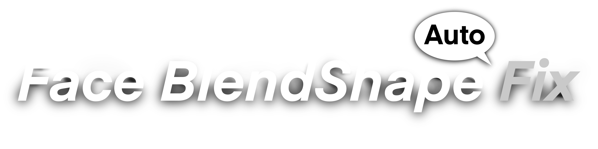

## Non-destructive BlendShape correction for avatars

**Face BlendShape Fix** is a Unity tool that bakes correction into target BlendShapes. It detects current BlendShape weights on the renderer and applies a reverse correction when building the avatar so the final shapes behave as intended.
Built on the Non-Destructive Modular Framework (NDMF) for fully reversible builds and real-time preview.

## Overview

When avatar faces are edited (for example, closing eyes or opening the mouth), existing BlendShapes can appear broken because they were authored on the original mesh pose. This tool subtracts the influence of currently-active BlendShapes, producing corrected deltas that behave as intended.

## Features

- Detects current BlendShape weights from the renderer
- Bakes reverse correction into target BlendShapes on avatar build
- Calculates weights from BlendShape similarity
- NDMF preview support

## Requirements

- Unity 2022.3.22f1 (LTS)
- NDMF
- VRChat SDK3 Avatars

## Usage

1. Add **FaceBlendShapeFixComponent** to your avatar.
2. Set the target renderer and configure target shapes.
3. Set the weights to the desired correction values.
4. Build the avatar or enter Play Mode to bake the reverse correction into the target BlendShapes.

## Package Structure

```
com.triturbo.face-blendshape-fix/
├── Runtime/                          # Runtime components and data types
│   ├── FaceBlendShapeFixComponent.cs # Main MonoBehaviour
│   └── Categories/
│       └── BlendShapeCategoryDatabase.cs  # ScriptableObject for categorizing shapes
├── Editor/                           # Editor-only processing
│   ├── NDMFPlugin.cs                 # NDMF plugin registration
│   ├── FaceBlendShapeFixPass.cs      # Build pass that bakes corrected shapes
│   ├── MeshBlendShapeProcessor.cs    # Core mesh processing logic
│   ├── PreviewMeshBuilder.cs         # Preview mesh generation
│   ├── FaceBlendShapeFixPreviewFilter.cs  # NDMF preview integration
│   └── Inspector/                    # Custom editor UI
│       ├── FaceBlendShapeFixEditor.cs     # Main inspector
│       ├── TargetShapeArrayDrawer.cs      # Target shapes list UI
│       ├── BlendDataDrawer.cs             # Blend data visualization
│       ├── BlendShapeDefinitionDrawer.cs  # Definition list UI
│       └── ...
└── package.json
```

## Core Concepts

### BlendShape Correction

This tool subtracts the influence of currently active BlendShapes from target shapes, producing corrected deltas. This fixes shapes authored on the original mesh pose after edits like closed eyes or open mouths.

### Key Types

- **FaceBlendShapeFixComponent**: Main component attached to avatars. Holds target renderer reference, blend shape definitions, target shapes, and category databases.
- **TargetShape**: Defines a BlendShape to fix.
  - `m_TargetShapeName`: Name of the BlendShape to correct
  - `m_CategoryName`: Category for grouping in UI (empty string = uncategorized)
  - `m_BlendData[]`: BlendShapes to subtract (inverse blend)
  - `m_AdditionalBlendData[]`: BlendShapes to add (additive blend)
  - `m_TargetShapeType`: Eye/Mouth categorization (affects left/right weight handling)
  - `m_UseGlobalDefinitions`: Whether to use global definition weights
- **BlendShapeDefinition**: Global weight definitions for BlendShapes across different face regions (left eye, right eye, mouth). Supports `m_Protected` flag.
- **BlendData**: Per-shape blend weights with optional left/right split for asymmetric corrections.
- **ShapeType**: Enum for categorization — `BothEyes`, `LeftEye`, `RightEye`, `Mouth`, `Others`

## Build Pipeline

Uses NDMF (Non-Destructive Modular Framework):

1. `NDMFPlugin` registers the plugin in `BuildPhase.Generating`.
2. `FaceBlendShapeFixPass` runs `MeshBlendShapeProcessor.BakeCorrectedShapes()` to create corrected mesh.
3. Components are removed after processing (IEditorOnly).

## Preview System

- `FaceBlendShapeFixPreviewFilter`: NDMF IRenderFilter for live preview
- `ShapeBlendPreviewNode`: Handles per-frame preview updates
- `PreviewMeshBuilder`: Creates temporary meshes with `.inv.L/.inv.R` and `.add.L/.add.R` shapes for real-time preview


## License
This project is licensed under the [MIT License](./LICENSE.md).